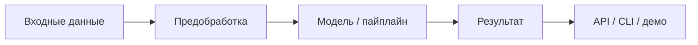

# Архитектура решения

**Выбранное задание:** `1` | `2` | `3`

## Общая схема

## Компоненты в `src/`

| Модуль | Путь | Назначение |
|--------|------|------------|
| Точка входа | `src/app/` | API, CLI, веб-интерфейс |
| Данные | `src/data_processing/` | Загрузка и подготовка |
| Модели | `src/models/` | Обучение и инференс |
| Утилиты | `src/utils/` | Конфиг, логи, метрики |

## Контейнеризация

- Сборка: `Dockerfile`
- Оркестрация: `docker-compose.yml`
- Команды для агента: [DEPLOY.md](../DEPLOY.md)

## Ключевые решения

Опишите выбор технологий и trade-off'ы для **вашего** задания.

### Задание 1

- Чтение mrxs, метод сшивки, формат выхода

### Задание 2

- Целевая переменная, модель, валидация, метрики

### Задание 3

- LLM, RAG, мультиагенты, guardrails

Удалите неактуальные подразделы.

## Ограничения

Что не успели реализовать, узкие места по производительности.
