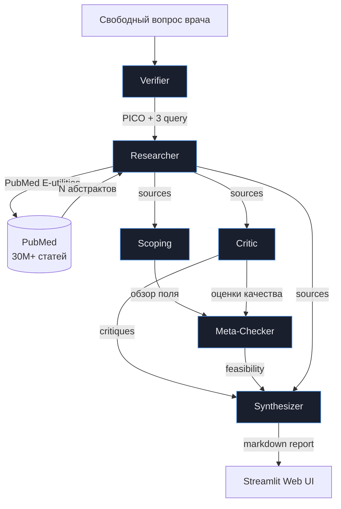

# Архитектура решения

**Трек 3** — AI-ассистент для научных исследований.

## Общая схема



## Шесть агентов

### 1. Verifier

**Задача:** структурировать свободный вопрос врача в PICO и сгенерировать поисковые запросы.

**Вход:** строка на естественном языке (русский).
**Выход:** JSON c полями `population`, `intervention`, `comparator`, `outcomes`, `search_queries` (broad/specific/trials_focused), `is_answerable`, `clarification_needed`.

**Модель:** `yandexgpt/rc` — нужен качественный русский, аккуратное извлечение биомаркеров.

**Ключевое решение:** генерируем **3 разных поисковых запроса** вместо одного. Это даёт покрытие разных формулировок (broad — широкий охват, specific — узкий с биомаркером, trials_focused — с упоминанием известного РКИ типа AURA3). Запросы простые ключевые слова без MeSH-тегов — это эмпирически даёт лучшие результаты в PubMed чем переусложнённые запросы со скобками и AND/OR.

### 2. Researcher

**Задача:** найти статьи в PubMed по запросам от Verifier.

**Вход:** список поисковых запросов.
**Выход:** массив объектов с полями `pmid`, `title`, `abstract`, `year`, `journal`, `authors`, `doi`.

**Не LLM-агент.** Прямой вызов PubMed E-utilities API (`esearch` + `efetch`). Это критически важно — никаких выдуманных PMID, только реальные публикации.

**Ключевое решение:** запускаем 3 запроса параллельно, **объединяем результаты по PMID** (дедупликация), ограничиваем общим лимитом. Так система находит ~10 уникальных статей с покрытием разных формулировок темы.

### 3. Scoping

**Задача:** провести Scoping Review — картирование научного поля.

**Вход:** PICO + все найденные источники.
**Выход:** JSON с типами публикаций, изученными популяциями, исходами, сравниваемыми вмешательствами, временным распределением, пробелами в исследованиях.

**Модель:** `yandexgpt/rc`.

**Отличие от Critic:** Scoping не отбирает источники по PICO — он картирует поле. Отвечает на вопрос "что вообще существует", а не "что нам подходит".

### 4. Critic

**Задача:** оценить каждый источник по принятым в EBM методикам.

**Вход:** PICO + источник.
**Выход:** для каждой статьи — `study_type`, `evidence_level` (Oxford CEBM 1-5), `quality_method` (RoB 2.0 / ROBINS-I / STROBE / AMSTAR-2), `quality_assessment` (high/moderate/low), `relevance_to_pico`, `include` (true/false), `exclude_reason`.

**Модель:** `yandexgpt/rc` — нужно качество для оценки методологий.

**Ключевое решение:** строгий чек-лист причин исключения (`wrong_population`, `wrong_intervention`, `wrong_study_design`, `low_evidence_level`, и т.д.) — это даёт прозрачность и аудируемость решений.

### 5. Meta-Checker

**Задача:** оценить, возможен ли метаанализ найденных РКИ.

**Вход:** PICO + только включённые источники (`include=true`).
**Выход:** JSON с `feasibility` (possible/partially_possible/not_possible), оценкой гомогенности популяции и вмешательств, доступности данных по каждому исходу.

**Модель:** `yandexgpt/rc`.

**Принципиальное решение:** **НЕ выполняем метаанализ**. Не считаем pooled HR, не строим forest plot. Только оцениваем возможность по критериям Cochrane Handbook. Это методологически безопасно — расчёт метаанализа без биостатистической экспертизы привёл бы к ложным выводам.

### 6. Synthesizer

**Задача:** сформировать финальный отчёт для врача.

**Вход:** PICO + оценки Critic + источники с абстрактами.
**Выход:** Markdown-отчёт со структурой: PICO → клинический вывод → таблица включённых исследований → сводка доказательной базы → ограничения → PRISMA-диаграмма.

**Модель:** `qwen3-235b-a22b-fp8/latest` — большая модель для финального синтеза, лучшая работа с длинным контекстом.

**Гарантии против галлюцинаций:**
- В промпте явно: "Используй ТОЛЬКО данные из переданных источников. НИКАКИХ выдуманных PMID, авторов, цифр."
- Цифры цитируются с указанием PMID
- Если данных недостаточно — обязано прямо сказать "недостаточно данных"
- Финальный дисклеймер: не является клинической рекомендацией, опираться на NCCN/ESMO/RUSSCO

## Стек технологий

| Слой | Технология | Обоснование |
|---|---|---|
| LLM | Yandex AI Studio | Российский провайдер, бесплатный grant, OpenAI-совместимый API |
| Поиск | PubMed E-utilities | Официальный API NCBI, бесплатный, без лимитов на чтение |
| Веб | Streamlit 1.58 | Быстрая разработка веб-UI на Python, рендерит markdown нативно |
| HTTP | requests, openai SDK | OpenAI-совместимый клиент работает с Yandex AI Studio |
| Парсинг XML | xml.etree (stdlib) | Парсинг ответов PubMed efetch |
| Контейнер | Docker + Compose | Воспроизводимость, изоляция зависимостей |

## Выбор моделей по агентам

| Агент | Модель | Почему |
|---|---|---|
| Verifier | yandexgpt/rc | Качественный русский, извлечение биомаркеров |
| Critic | yandexgpt/rc | Оценка методологий требует понимания нюансов |
| Scoping | yandexgpt/rc | Длинный JSON с русским текстом |
| Meta-Checker | yandexgpt/rc | Структурированный JSON, аккуратность |
| Synthesizer | qwen3-235b-a22b-fp8 | Большой контекст, лучший синтез длинного текста |

DeepSeek-v4-flash тестировался для Verifier/Critic — это reasoning-модель, она тратит много токенов на скрытое рассуждение, что приводит к усечению JSON-ответов. YandexGPT/RC даёт стабильно более предсказуемый формат.

## Поток данных между агентами

```python
# Псевдокод оркестратора (src/app/pipeline.py)
pico = verify_question(client, question)
sources = []
for query in pico["search_queries"].values():
    sources += search_pubmed_direct(query, max_results=N)
sources = deduplicate_by_pmid(sources)[:max_sources]

scoping = scope_field(client, pico, sources)
critiques = critique_sources(client, pico, sources)
meta_check = check_meta_feasibility(client, pico, critiques, sources)
report = synthesize_report(client, pico, critiques, sources)
```

Подробности по структурам данных — [data_schema.md](data_schema.md).

## Контейнеризация

- **Dockerfile:** `python:3.11-slim`, установка зависимостей через pip с фиксированными версиями
- **docker-compose.yml:** один сервис `app`, проброс порта 8501, монтирование `.env`
- **requirements.txt:** все зависимости с точными версиями (torch CPU-only через `--extra-index-url`)
- Команды для развёртывания — [DEPLOY.md](../DEPLOY.md)

## Ключевые архитектурные решения

### Почему мультиагентная архитектура, а не один большой промпт

Один LLM-вызов с задачей "проанализируй литературу" даст текст, который сложно проверить и легко содержит галлюцинации. Разделение на агентов даёт:

- **Прозрачность:** каждый шаг виден отдельно
- **Проверяемость:** результат Verifier и Researcher можно проверить независимо
- **Контроль качества:** Critic явно отделён от Synthesizer — оценка не смешивается с синтезом
- **Отладка:** при ошибке видно, на каком шаге она произошла

### Почему отдельный Meta-Checker, а не расчёт метаанализа

Расчёт объединённого HR требует:
- Извлечения сырых данных из полных текстов (не только абстрактов)
- Понимания гетерогенности исследований (I² statistic)
- Выбора модели (fixed effects vs random effects)
- Биостатистической экспертизы для интерпретации

Без всего этого расчёт метаанализа был бы методологически некорректным. Поэтому делаем **методологически безопасный шаг назад** — оцениваем только возможность.

### Почему Streamlit, а не FastAPI + React

Хакатон — 4 дня. Streamlit даёт работающий веб-UI за часы вместо дней. Жертвуем кастомизацией ради скорости разработки.

## Ограничения

- **Только PubMed.** Embase, Cochrane Library, региональные базы не включены
- **Только английский поиск.** Русскоязычные публикации не попадают в выдачу
- **Только абстракты.** Полные тексты не парсятся
- **Один пользователь за раз.** Не оптимизировано для нагрузки
- **Нет персистентности.** Каждый запрос — с нуля, нет истории запросов

## Что не успели

- Поддержка Embase (требует платной подписки и другого API)
- Кэширование PubMed-запросов (одинаковые запросы повторно дёргают API)
- Юнит-тесты на агенты
- Метрики качества (precision/recall на размеченном наборе вопросов)
- Multi-language UI

## Связанные документы

- [overview.md](overview.md) — обзор решения
- [data_schema.md](data_schema.md) — схемы данных
- [../DEPLOY.md](../DEPLOY.md) — развёртывание