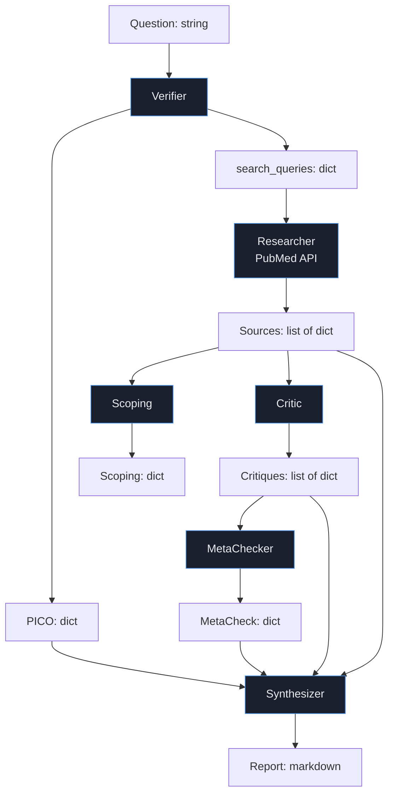

# Схемы данных

**Трек 3** — AI-ассистент для научных исследований.

Документ описывает структуры данных, которые передаются между агентами пайплайна.

## Источник данных

**PubMed** — открытая база медицинских публикаций от National Library of Medicine (NIH, США).

- Доступ: PubMed E-utilities API (https://www.ncbi.nlm.nih.gov/books/NBK25501/)
- Лицензия: open access, бесплатное использование
- Объём: 30+ миллионов записей, ежегодное пополнение ~1.5 млн
- Ограничения: rate limit 3 запроса в секунду без API-ключа, 10 с ключом

Наша система не хранит данные локально — все запросы идут к PubMed в реальном времени. Это гарантирует актуальность результатов.

## Структура: PICO (выход Verifier)

Формат вопроса по методологии PICO (Population, Intervention, Comparator, Outcomes).

```json
{
  "population": "пациенты с NSCLC, мутация EGFR T790M, прогрессия на гефитинибе",
  "intervention": "osimertinib",
  "comparator": "платина + пеметрексед",
  "outcomes": "эффективность лечения (ОВ, ВБП, ORR)",
  "search_queries": {
    "broad": "osimertinib NSCLC EGFR T790M",
    "specific": "osimertinib EGFR T790M progression gefitinib",
    "trials_focused": "osimertinib NSCLC EGFR T790M AURA3"
  },
  "is_answerable": true,
  "clarification_needed": ""
}
```

| Поле | Тип | Описание |
|---|---|---|
| `population` | string | Описание популяции пациентов |
| `intervention` | string | Изучаемое вмешательство |
| `comparator` | string | Сравнение (может быть пустым) |
| `outcomes` | string | Оцениваемые исходы |
| `search_queries.broad` | string | Широкий поисковый запрос (3-4 слова) |
| `search_queries.specific` | string | Узкий запрос с биомаркером |
| `search_queries.trials_focused` | string | Запрос с упоминанием известного РКИ |
| `is_answerable` | bool | Возможен ли ответ на вопрос через литературу |
| `clarification_needed` | string | Что уточнить у врача, если is_answerable=false |

## Структура: Source (выход Researcher)

Источник из PubMed.

```json
{
  "pmid": "27959700",
  "title": "Osimertinib or Platinum-Pemetrexed in EGFR T790M-Positive Lung Cancer.",
  "abstract": "BACKGROUND: Osimertinib is an oral, potent, irreversible inhibitor...",
  "year": "2017",
  "journal": "The New England journal of medicine",
  "authors": "Mok TS, Wu Y-L, Ahn M-J, et al.",
  "doi": "10.1056/NEJMoa1612674"
}
```

| Поле | Тип | Описание |
|---|---|---|
| `pmid` | string | PubMed ID, уникальный идентификатор статьи |
| `title` | string | Название публикации |
| `abstract` | string | Абстракт (полный) |
| `year` | string | Год публикации |
| `journal` | string | Название журнала |
| `authors` | string | Авторы (сокращённый список) |
| `doi` | string | DOI публикации (если есть) |

## Структура: Critique (выход Critic)

Оценка одного источника.

```json
{
  "pmid": "27959700",
  "title": "Osimertinib or Platinum-Pemetrexed...",
  "study_type": "RCT",
  "evidence_level": 2,
  "quality_method": "RoB_2.0",
  "quality_assessment": "high",
  "relevance_to_pico": "high",
  "include": true,
  "exclude_reason": ""
}
```

| Поле | Тип | Значения | Описание |
|---|---|---|---|
| `pmid` | string | — | PubMed ID |
| `study_type` | enum | RCT, non_randomized_trial, observational_cohort, observational_case_control, case_series, case_report, systematic_review, meta_analysis, narrative_review, in_vitro, preclinical_animal, guideline, other | Тип исследования |
| `evidence_level` | int | 1-5 | Oxford CEBM уровень доказательности |
| `quality_method` | enum | RoB_2.0, ROBINS-I, STROBE, AMSTAR-2, not_applicable | Применённая методика оценки |
| `quality_assessment` | enum | high, moderate, low, very_low, not_assessable | Оценка качества |
| `relevance_to_pico` | enum | high, medium, low | Релевантность вопросу |
| `include` | bool | — | Включать в систематический обзор |
| `exclude_reason` | enum | wrong_population, wrong_intervention, wrong_study_design, low_evidence_level, older_than_5_years_with_newer_data_available, duplicate, "" | Причина исключения (пусто если include=true) |

### Уровни Oxford CEBM

| Уровень | Описание |
|---|---|
| 1 | Систематические обзоры РКИ / метаанализы |
| 2 | Отдельные РКИ |
| 3 | Нерандомизированные контролируемые / когортные |
| 4 | Серии случаев, низкокачественные когортные |
| 5 | Экспертное мнение, in vitro, preclinical |

## Структура: Scoping (выход Scoping-агента)

Картирование научного поля.

```json
{
  "publication_types": {
    "клиническое исследование (фаза III)": 3,
    "обзорная статья": 2
  },
  "populations_studied": [
    "пациенты с NSCLC и мутацией EGFR T790M",
    "пациенты с резектабельным NSCLC стадии II-IIIB"
  ],
  "outcomes_assessed": [
    "общая выживаемость (ОВ)",
    "выживаемость без прогрессирования (ВБП)",
    "объективный ответ (ORR)"
  ],
  "interventions_compared": [
    "осимертиниб 80 мг",
    "сорафениб 400 мг"
  ],
  "time_distribution": {
    "2017": 1,
    "2020": 2,
    "2022": 1
  },
  "knowledge_gaps": [
    "недостаточно данных о долгосрочных исходах",
    "не изучены подгруппы с метастазами в ЦНС"
  ],
  "summary": "Краткое резюме научного поля в 2-3 предложениях."
}
```

## Структура: MetaCheck (выход Meta-Checker)

Оценка возможности метаанализа.

```json
{
  "feasibility": "partially_possible",
  "feasibility_label": "Частично возможен",
  "n_rcts": 3,
  "outcomes_with_enough_data": [
    {
      "outcome": "общая выживаемость (ОВ)",
      "n_studies_reporting": 2,
      "data_quality": "high",
      "notes": "Данные представлены в двух исследованиях с сопоставимыми группами"
    }
  ],
  "homogeneity_assessment": {
    "population": "moderately_heterogeneous",
    "intervention": "homogeneous",
    "notes": "Популяция несколько различается: нерезектабельная vs резецированная ГЦК"
  },
  "limitations": [
    "Различия в популяциях пациентов",
    "Разные группы сравнения (сорафениб vs активное наблюдение)"
  ],
  "recommendation": "Метаанализ частично возможен. Рекомендуется отдельный анализ по ОВ и ВБП для исследований с сопоставимыми группами."
}
```

| Поле | Значения | Описание |
|---|---|---|
| `feasibility` | possible / partially_possible / not_possible | Возможность метаанализа |
| `n_rcts` | int | Число включённых РКИ |
| `homogeneity_assessment.population` | homogeneous / moderately_heterogeneous / heterogeneous | Однородность популяции |
| `homogeneity_assessment.intervention` | homogeneous / moderately_heterogeneous / heterogeneous | Однородность вмешательств |
| `data_quality` (внутри outcome) | high / moderate / low | Качество данных по исходу |

## Финальный отчёт (выход Synthesizer)

Markdown-документ со следующей структурой:

1. **Структурированный вопрос (PICO)** — повтор PICO
2. **Краткий клинический вывод** — 2-4 предложения + уровень определённости
3. **Включённые исследования** — markdown-таблица с PMID/дизайн/n/год/исход/результат/качество
4. **Сводка доказательной базы** — типы исследований, согласованность, пробелы
5. **Ограничения и риски** — что неизвестно, какие исследования упущены, обязательный дисклеймер
6. **Диаграмма скрининга** — найдено N, включено M, исключено K с причинами

## Поток данных в пайплайне



## Что НЕ хранится

Система не сохраняет:

- Запросы пользователей
- Результаты предыдущих сессий
- Персональные данные

Каждая сессия — изолированная, in-memory. Это упрощает соблюдение медицинской тайны при гипотетическом продакшен-использовании.

## Связанные документы

- [overview.md](overview.md) — обзор проблемы и сценариев
- [architecture.md](architecture.md) — архитектура агентов